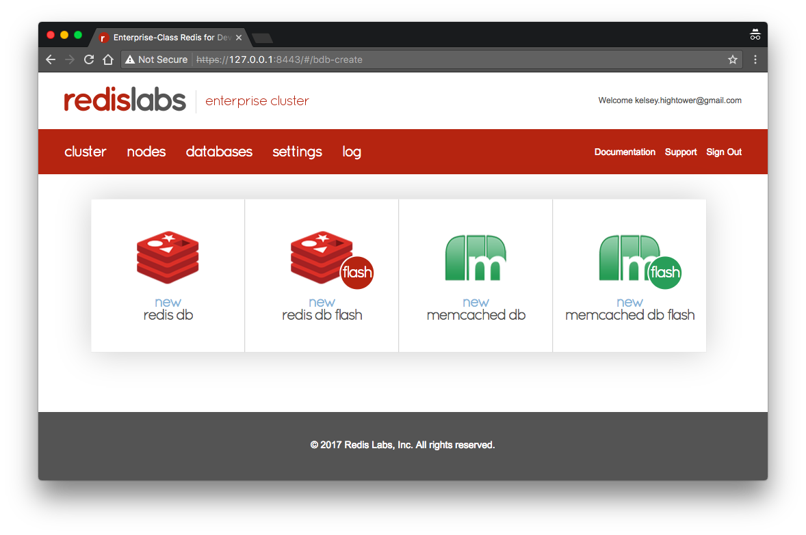

# Redis Enterprise on Kubernetes

This tutorial will walk you through provisioning a three node [Redis Enterprise](https://redislabs.com/redis-enterprise-documentation/overview) cluster with support for the [Redis Flash](https://redislabs.com/redis-enterprise-documentation/concepts-architecture/concepts/redis-e-flash) feature, which allows you to create databases that span both RAM and flash memory (SSD) for larger datasets.

## Prerequisites

This tutorial requires a working Kubernetes cluster with a dedicated set of nodes for Redis Enterprise. In this section you will create a six node cluster using [Google's Container Engine](https://cloud.google.com/container-engine).

Create the initial cluster:

```
gcloud beta container clusters create k0 \
  --cluster-version 1.6.4 \
  --num-nodes 3 \
  --machine-type n1-standard-2
```

Add a dedicated set of worker nodes for the Redis Enterprise cluster: 

```
gcloud beta container node-pools create redis-enterprise-pool \
  --cluster k0 \
  --local-ssd-count 1 \
  --machine-type n1-standard-2 \
  --num-nodes 3 \
  --node-labels dedicated=redis-enterprise
```

> After adding the `redis-enterprise-pool` node pool the Kubernetes API will down for a few minutes while the cluster state is being reconciled. Check the cluster status using the `gcloud container clusters list` command.

Each dedicated worker has an attached [local SSD](https://cloud.google.com/compute/docs/disks/local-ssd) and will include a [node label](https://kubernetes.io/docs/concepts/configuration/assign-pod-node/#step-one-attach-label-to-the-node) `dedicated=redis-enterprise`, which will be used attract Redis Enterprise pods. 

## Taint the Dedicated Worker Nodes

In this section you will [taint](https://kubernetes.io/docs/concepts/configuration/assign-pod-node/#taints-and-tolerations-beta-feature) a subset of the worker nodes to ensure only the Redis Enterprise pods are scheduled on them.

Extract the worker node names that have the `dedicated=redis-enterprise` node label set:

```
DEDICATED_NODES=$(kubectl get nodes -l dedicated=redis-enterprise -o jsonpath={.items[*].metadata.name})
```

Taint the dedicated worker nodes:

```
kubectl taint nodes ${DEDICATED_NODES} dedicated=redis-enterprise:NoSchedule
```

At this point only pods with the following toleration will be scheduled on the dedicated worker nodes:

```
tolerations:
  - key: dedicated
    operator: "Equal"
    value: redis-enterprise
    effect: "NoSchedule"
```

See the [redis-enterprise](statefulsets/redis-enterprise.yaml) StatefulSet for more details.

## Deploy Redis Enterprise

In this section you will deploy the `redislabs/redis:4.5.0-22` container image using a [StatefulSet](https://kubernetes.io/docs/concepts/workloads/controllers/statefulset). 

Create a secret to hold the Redis Enterprise license key and authentication credentials:

```
REDIS_CLUSTER_USERNAME="kelsey.hightower@gmail.com"
```

```
REDIS_CLUSTER_PASSWORD="redislabs123"
```

```
kubectl create secret generic redis-enterprise \
  --from-literal "password=${REDIS_CLUSTER_PASSWORD}" \
  --from-literal "username=${REDIS_CLUSTER_USERNAME}" \
  --from-file "license.key=${HOME}/license.key"
```

Create a configmap to hold the Redis Enterprise configuration file and cluster name:

```
kubectl create configmap redis-enterprise \
  --from-literal "name=cluster.local" \
  --from-file configs/ccs-redis.conf
```

Create the `redis-enterprise` headless service to expose each StatefulSet member internally:

```
kubectl create -f services/redis-enterprise.yaml
```

Create the `redis-enterprise-lb` service to provide an inter-cluster LB for the Redis discovery service and client connectivity:

```
kubectl create -f services/redis-enterprise-lb.yaml
```

Create the `redis-enterprise` statefulset:

```
kubectl create -f statefulsets/redis-enterprise.yaml
```

## The Redis Labs Dashboard

Use the `kubectl port-forward` command to setup a secure tunnel to the Redis Labs dashboard:

```
kubectl port-forward redis-enterprise-0 8443:8443
```

Visit [https://127.0.0.1:8443](https://127.0.0.1:8443) in your browser.


